# From Blind Spots to Real-Time Alerts: Monitoring, Alerting & Uptime Checks Observability with GCP

## The Blind Spot Problem

Your application is running on Google Cloud. Three VMs spinning up, processing requests, serving users. But here's the question nobody asks until something breaks: *What's actually happening inside those boxes right now?*

Most teams don't know. They deploy infrastructure, configure networking, set firewall rules, and then hope nothing fails. When it does, the scramble begins. No visibility. No metrics. No idea where to look. You're troubleshooting in the dark.

This is the blind spot.

For security engineers, observability is non-negotiable. You can't detect a breach you don't see. You can't prove compliance if you have no audit trail. You can't respond to incidents if you don't know they're happening. And you definitely can't troubleshoot application failures without understanding what your infrastructure is actually doing.

This guide walks you through building a monitoring foundation on GCP that answers the questions you'll need when things go wrong: What happened? When did it happen? Why did it happen? And how do I prevent it next time?

---

## Why Observability Matters (Before We Start)

Observability isn't just ops work. It's security work.

- **Incident detection**: Unusual CPU spikes = possible breach, crypto-mining, or DDoS. You'll see it in real-time.
- **Compliance audit trail**: Regulators ask: "Can you prove your systems were monitored?" Monitoring policies answer that.
- **MTTR (Mean Time To Respond)**: Without metrics, incident response is guesswork. With them, you're pointing at data.
- **Troubleshooting**: Customer reports slowness. You have exact CPU/memory/disk metrics from that moment. No more "works for us, maybe your ISP?"

Now let's build it.

---

## Prerequisites

You'll need:
- Your Google Cloud project  (Three VM instances [nginxstack-1, nginxstack-2, nginxstack-3] in this example)
- Access to the Cloud Console
- An email address for alert notifications

---

## Step 1: Verify Your Resources

Before monitoring, confirm what you're monitoring.

In the Google Cloud console, navigate to **Compute Engine > VM instances**.

You should see three instances listed:
- nginxstack-1
- nginxstack-2
- nginxstack-3

All three should have green status indicators. This is your infrastructure baseline.

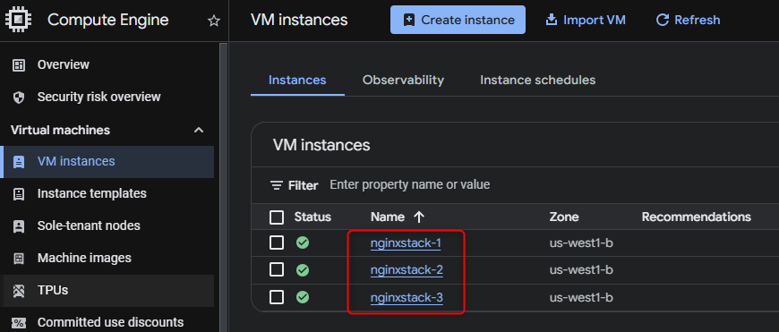

---

## Step 2: Custom Dashboard - Visibility Into What Matters

**Why this step:** A dashboard is your command center. Instead of clicking through the console to find metrics, you're looking at the data that matters to you right now. For security and ops teams, this is where you spot anomalies fast.

### Creating Your Dashboard

1. Navigate to **Observability > Monitoring** in the Cloud Console
2. Click **Dashboards** in the left pane
3. Click **Create Custom Dashboard**
4. Click **New Dashboard**
5. Name it "Monitoring Dashboard"

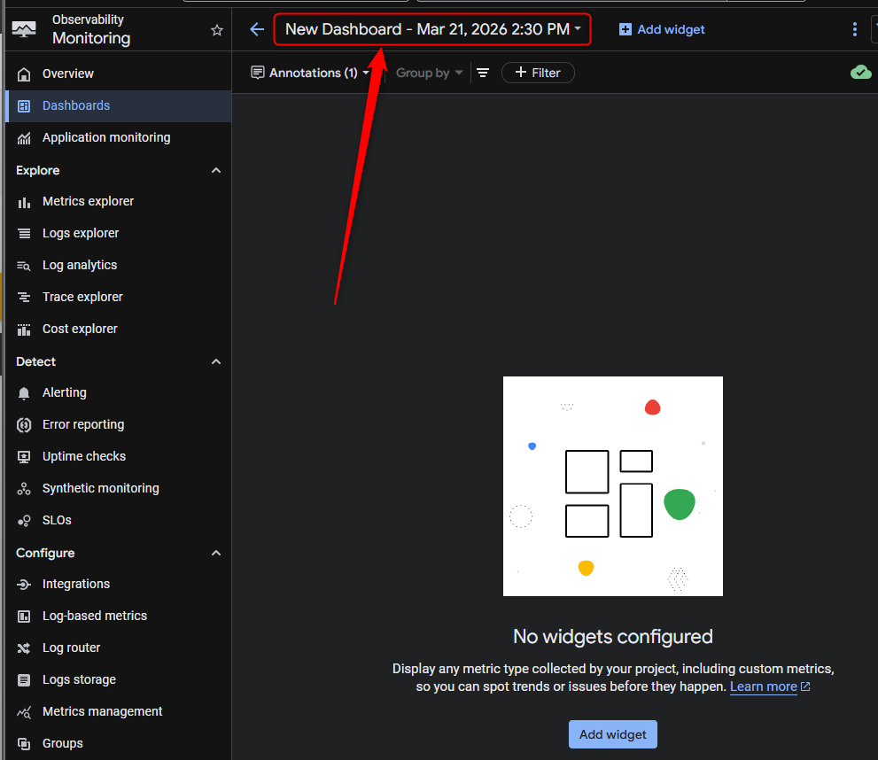

### Adding Your First Chart

Now you'll add a CPU utilization chart. This is foundational: CPU spikes can indicate resource exhaustion, malicious activity, or misconfiguration.

1. Click **Add widget** > select **Line** chart
2. Name the widget "My Chart"
3. In the metric selector, type "CPU utilization"
4. Select **VM Instance > Instance > CPU utilization** and click **Apply**
   - Note: If you can't find it, uncheck the "Active" filter
5. Click **+ Add Filter** to explore filtering options (by instance name, zone, etc.)
6. Click **Apply** to create the chart

Your dashboard now shows CPU utilization across your VMs in real-time. This is what visibility looks like.

**Pro tip:** Add more charts. Memory utilization, network bytes in/out, disk operations. Build the dashboard that answers your questions before they're urgent.

### Optional: Metrics Explorer

If you want to explore metrics without adding them to a dashboard:

1. Click **Metrics explorer** in the left pane
2. Select metrics and experiment
3. This is useful for ad-hoc troubleshooting without cluttering your dashboard

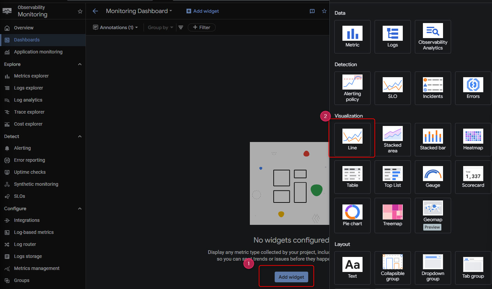

---

## Step 3: Alerting Policies - Catching Incidents Before They Escalate

**Why this step:** A dashboard is passive. You look at it when you remember. Alerts are active. They find you when things go wrong. For security teams, this is your early warning system.

The scenario: CPU usage spikes to 100% on one of your VMs. Without an alert, you discover this when users complain. With an alert, you're investigating in minutes.

### Creating Your Alert Policy

1. Click **Alerting** in the left pane
2. Click **+ Create policy**
3. Click **Select a metric dropdown**, uncheck "Active"
4. Type "VM Instance" and select **VM Instance > Instance > CPU usage**
5. Click **Apply**
6. Set **Rolling window** to 1 min (detect fast spikes)
7. Click **Next**

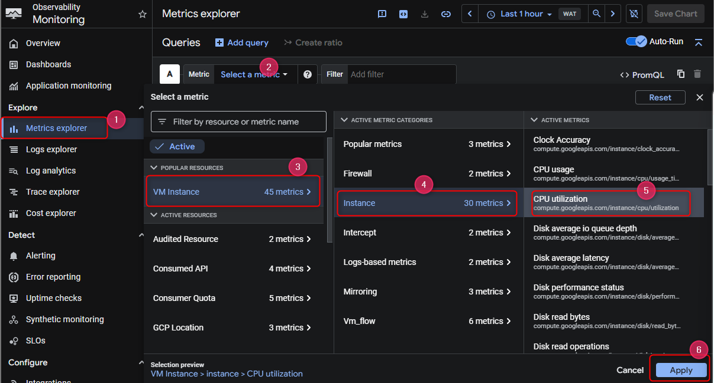

### Setting the Threshold

1. Set **Threshold position** to "Above Threshold"
2. Set the threshold value to **20** (CPU usage %)
3. Click **Next**

This means: "Alert me if CPU usage exceeds 20% for 1 minute." Adjust based on your baseline.

### Adding a Second Condition

Alerts are more powerful when you stack conditions. This reduces false positives.

1. Click **+ Add alert condition**
2. Select **VM Instance > Instance > CPU utilization** (note: different metric)
3. Set rolling window to 1 min
4. Set threshold to 20 (above threshold)
5. Click **Next**

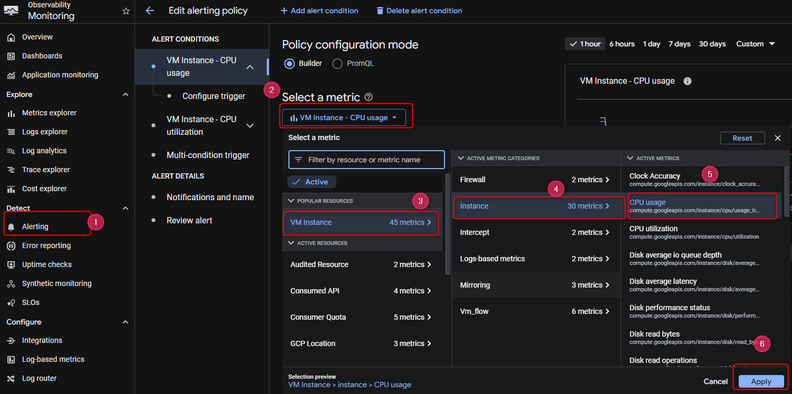

### Multi-Condition Logic

1. Select **All conditions are met** in the Multi-condition trigger
2. Click **Next**

This means both metrics must breach their thresholds simultaneously for the alert to fire. This is smarter than single-metric alerts.

---

## Step 4: Configure Notifications - Getting Alerted

**Why this step:** An alert that doesn't notify you is useless. You need this to reach you reliably, whenever it happens.

### Setting Up Email Notifications

1. Click **Notification Channels** dropdown
2. Click **Manage Notification Channels**

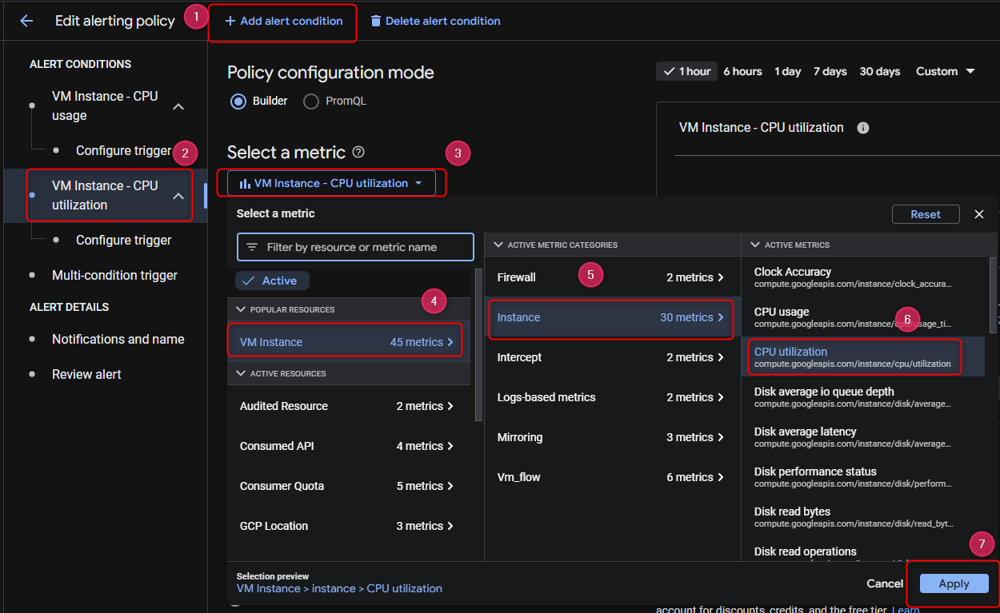

A new tab will open.

3. Scroll down and find **Email**
4. Click **Add New**
5. Enter your email address and a display name (e.g., "Security Team")
6. Click **Save**

### Finishing the Alert Policy

1. Go back to the alert creation tab
2. Click **Notification Channels**, then click the **Refresh icon**
3. Select your email display name
4. Click **Ok**
5. Name your policy "My Alert Policy"
6. Click **Next**
7. Review and click **Create Policy**

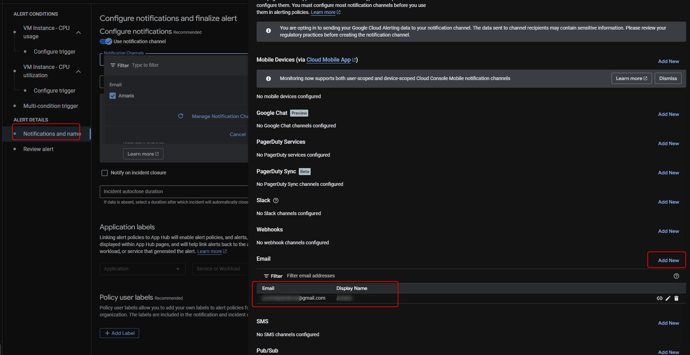

Your alert is now live. When CPU usage on any of your VMs hits the threshold, you'll receive an email.

---

## Step 5: Resource Groups - Organizing for Faster Response

**Why this step:** As your infrastructure grows, you'll have dozens or hundreds of resources. Groups let you apply policies, dashboards, and alerts to logical collections instead of managing them individually.

Example use case: All production web servers in one group. All database instances in another. Different alert thresholds for each.

### Creating a Resource Group

1. Click **Groups** in the left pane
2. Click **+ Create Group**
3. Name it "VM instances"
4. In the Criteria section, type "nginx" in the **Contains** field
5. Click **Done**
6. Click **Create**

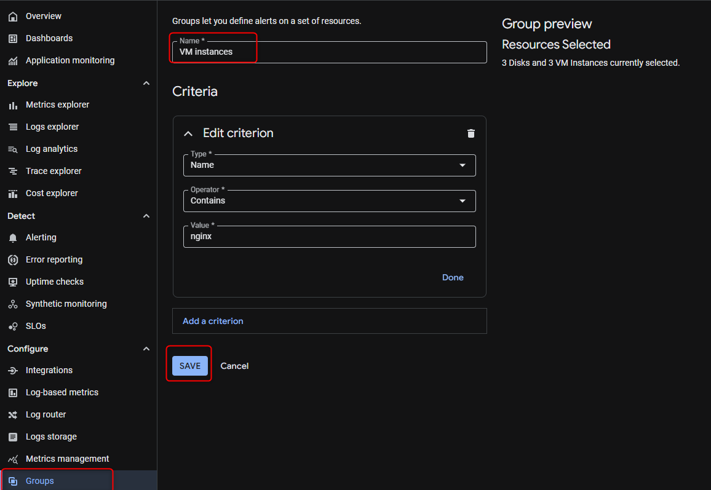

This group automatically pulls in any resource with "nginx" in its name. Right now, that's all three VMs. Cloud Monitoring generates a dashboard for this group automatically.

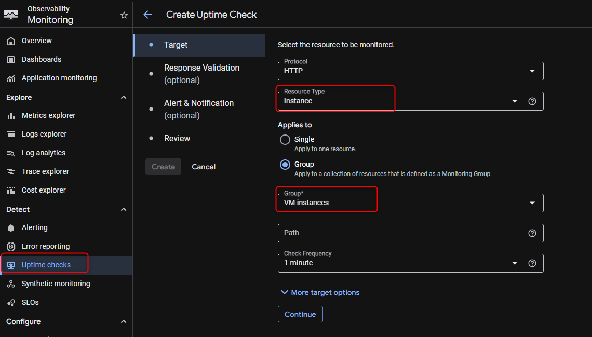

**Why this matters for security:** You can now create group-level policies. One alert for "all production servers." If you add a fourth nginx VM, it's automatically included. Consistency at scale.

---

## Step 6: Uptime Monitoring - Detecting Service Failures in Real-Time

**Why this step:** CPU metrics tell you the system is working. Uptime checks tell you *the service is responding*. This is the difference between "the server is running" and "users can access the application."

Uptime checks are also your first line of defense against service compromise. If an attacker shuts down your application, you know immediately.

### Creating an Uptime Check

1. Click **Uptime checks** in the left pane
2. Click **+ Create uptime check**
3. Configure as follows:
   - **Protocol:** HTTP
   - **Resource Type:** Instance
   - **Applies To:** Group
   - **Group:** VM instances
   - **Check Frequency:** 1 minute

[IMAGE: Uptime check target configuration]

4. Click **Continue**

### Adding Alerts to Uptime Checks

1. Click **Alert & Notification**
2. Select your email notification channel
3. Click **Continue**

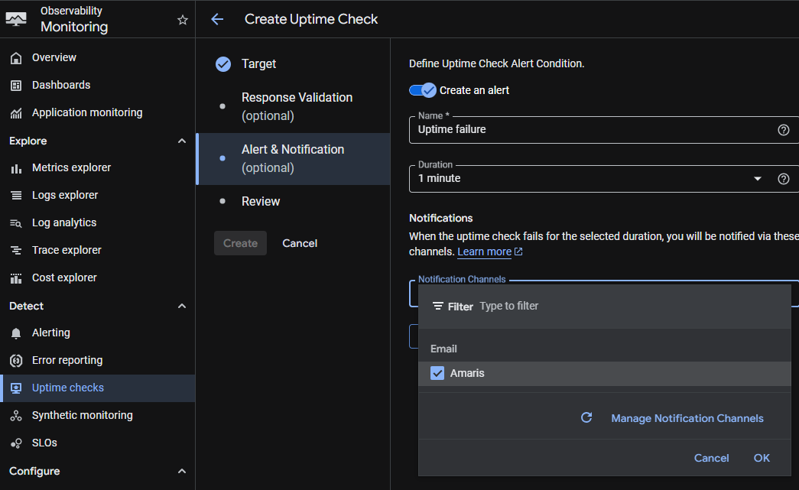

4. For **Title**, type "My Uptime check"
5. Click **Test** to verify connectivity

When you see a green checkmark, the uptime check successfully reached your resources.

6. Click **Create**

The uptime check takes a few minutes to become active. Once it does, you'll receive an email if any resource in the group becomes unreachable.

---

## What You'll Actually See: The Alert Email

When your alert fires, here's what lands in your inbox:

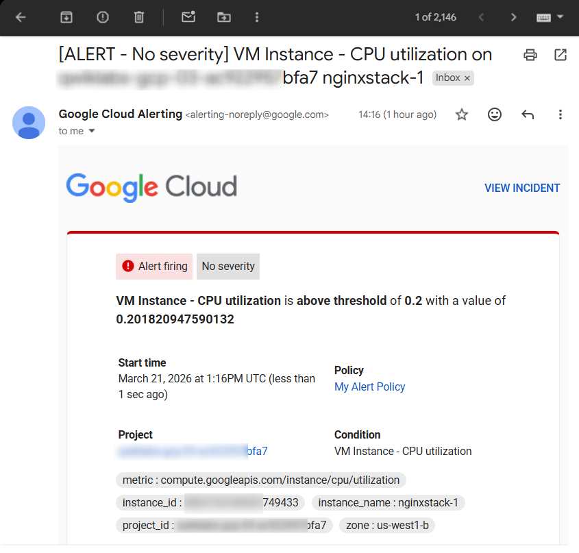

This tells you:
- Which policy triggered ("My Alert Policy")
- What condition was met (CPU usage exceeded threshold)
- Which resource (instance name, zone)
- When it happened (timestamp)
- A direct link to investigate in the console

**Real-world scenario:** You get this email at 2 AM. CPU spiked on nginxstack-2. You click the link, see the dashboard, check logs, find a runaway process, kill it. MTTR: 10 minutes. Without monitoring: MTTR: 2 hours (when the on-call wakes up to user complaints).

---

## What You've Built

You now have:

1. **Visibility** - Real-time dashboards showing what your infrastructure is doing
2. **Detection** - Alerts that notify you when thresholds are breached
3. **Organization** - Resource groups that scale as your infrastructure grows
4. **Availability monitoring** - Uptime checks that confirm services are responding
5. **Audit trail** - Email notifications timestamped for compliance

This is observability. This is how you move from blind spots to real-time awareness.

---

## Next Steps

From here :

- **Add more metrics**: Memory, disk, network. Build dashboards that answer your specific questions.
- **Refine thresholds**: The 20% CPU threshold will change based on your actual baselines. Monitor for a week, then adjust.
- **Create service-specific groups**: Separate production from staging. Different alert rules for each.
- **Integrate with SIEM**: Send alerts to Splunk, Datadog, or your security platform.
- **Build runbooks**: When an alert fires, what do you do? Document it. Share it with the team.

Observability isn't a one-time setup. It's a practice. You'll iterate, refine, and improve your monitoring as you learn what matters most to your infrastructure and your security posture.

---

## Why This Matters for Security Engineers

Monitoring is ops work on the surface. But for security teams, it's foundational:

- **Threat detection**: Anomalies in resource usage can indicate compromise
- **Compliance**: Auditors ask "How do you know what happened?" Monitoring answers that
- **Incident response**: MTTR is a security metric. Faster detection = faster containment
- **Trust**: Infrastructure you can't see, you can't defend

This guide gets you from blind to informed. From hoping nothing breaks to knowing when it does.

Now you're ready to build observability into everything you deploy.

# Author: Sylvester Baruch
